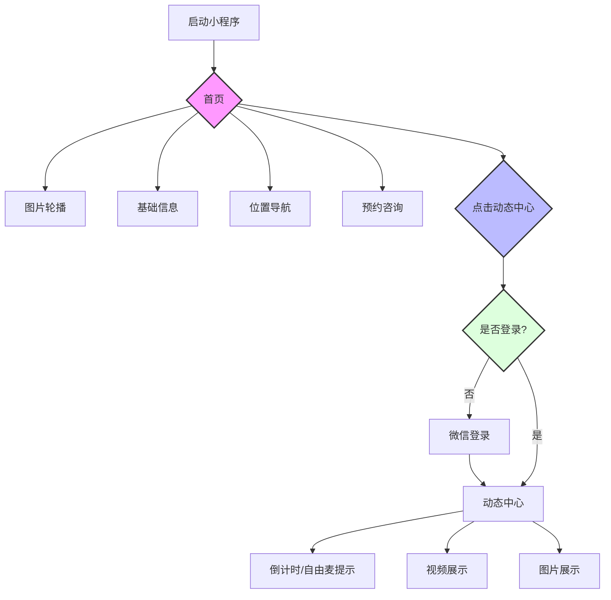
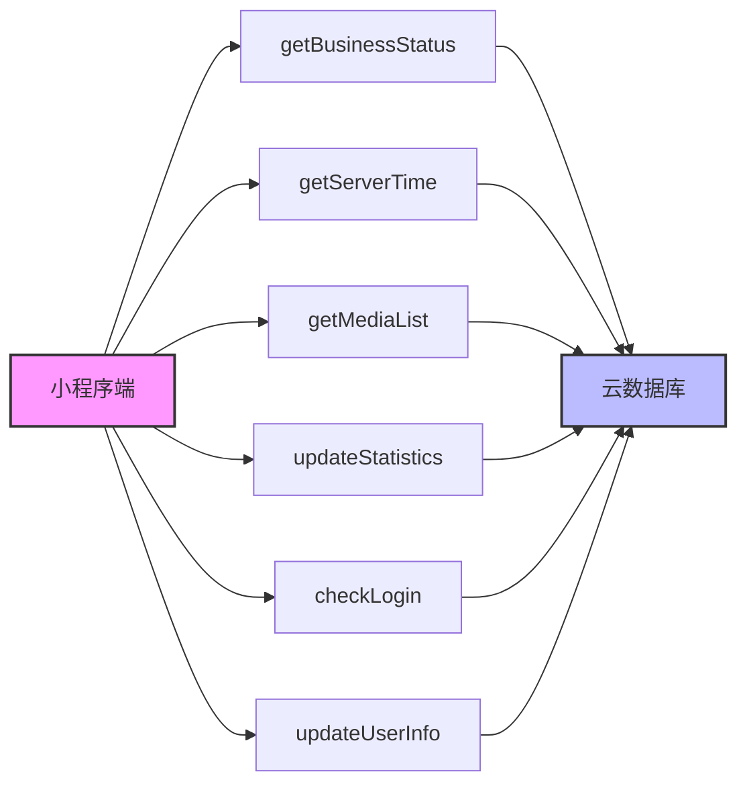
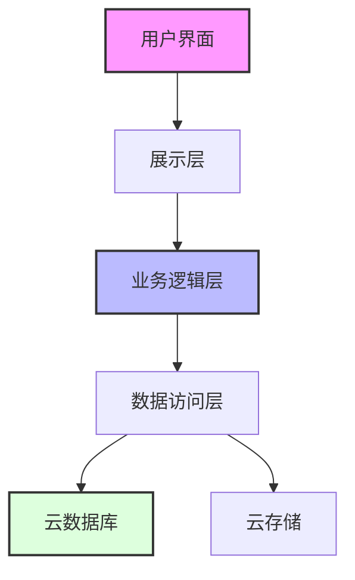

# 2046 R&B Bar小程序顶层设计

## 一、项目概述

2046 R&B Bar小程序是一个专注于展示酒吧特色和活动内容的微信小程序。项目采用微信小程序原生开发 + 云开发方案，通过Vant Weapp组件库构建UI界面，为用户提供优质的浏览体验。

### 核心功能
1. 信息展示：酒吧环境、营业信息、位置导航
2. 动态中心：活动视频、图片浏览（需要微信登录）
3. 特色功能：自由麦时间倒计时、一键导航、电话咨询

## 二、用户画像

### 主要用户群体

1. 年轻白领
- 年龄：25-35岁
- 特征：工作压力大，需要放松的休闲场所
- 需求：了解酒吧环境、查看表演节目、导航位置

2. 音乐爱好者
- 年龄：20-40岁
- 特征：热爱R&B音乐，喜欢参与现场表演
- 需求：关注自由麦时间、查看活动视频

3. 社交达人
- 年龄：22-38岁
- 特征：经常组织聚会，社交圈广
- 需求：查看营业状态、收藏精彩瞬间

### 用户痛点
1. 不了解酒吧具体位置和环境
2. 不清楚营业时间和活动安排
3. 想了解自由麦时间但信息获取不便
4. 需要提前了解场地氛围

## 三、流程图

## 四、接口设计

### 云函数接口

### 数据流转图

## 五、技术架构

### 前端架构
- 微信小程序原生开发
- Vant Weapp UI组件库
- 自定义组件封装
- 状态管理方案

### 后端架构
- 微信云开发
- 云函数处理业务逻辑
- 云数据库存储数据
- 云存储管理媒体文件

## 六、安全设计

### 访问控制
1. 动态中心强制微信登录
2. 云函数接口鉴权
3. 数据库访问权限控制
4. 文件存储安全策略

### 数据安全
1. 用户信息加密存储
2. 敏感信息脱敏处理
3. 定期数据备份
4. 访问日志记录

## 七、性能优化

### 加载优化
1. 图片资源压缩
2. 视频文件分片加载
3. 预加载机制
4. 本地缓存策略

### 运行优化
1. 组件按需加载
2. 分包加载机制
3. 长列表性能优化
4. 动画性能优化